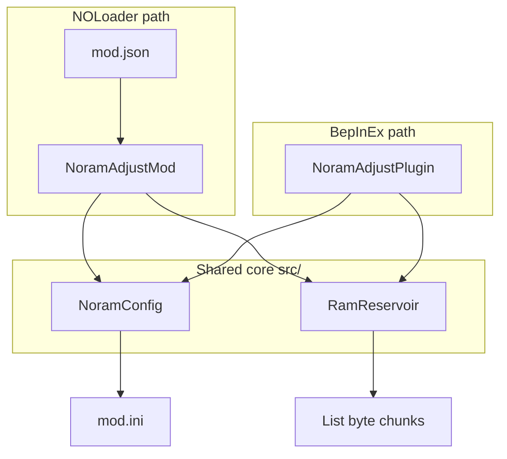

# Architecture

## Overview

NORAM Adjust is a minimal RAM budget mod. It does not patch game IL, hook gameplay systems, or run per-frame logic. A single allocation pass reserves managed memory and holds references until unload.

## Classes

| Type | File | Role |
|------|------|------|
| `NoramAdjustMod` | `src/NoramAdjustMod.cs` | `INOMod` entry; `OnLoad` / `OnUnload` |
| `NoramAdjustPlugin` | `BepInEx/NORAMAdjust/NoramAdjustPlugin.cs` | BepInEx `BaseUnityPlugin`; `Awake` / `OnDestroy` |
| `NoramConfig` | `src/NoramConfig.cs` | Parses `[NORAM]` section from `mod.ini` |
| `RamReservoir` | `src/RamReservoir.cs` | Chunked `byte[]` allocation; `TryApply` / `Release` |

BepInEx links `NoramConfig.cs` and `RamReservoir.cs` via MSBuild `<Compile Link=...>` so both loaders stay in sync.

## Allocation algorithm

1. Read `memory_reservoir_mb` (target) and `chunk_mb` (default 64).
2. Allocate `target / chunk_mb` full chunks plus one remainder chunk if needed.
3. Touch `chunk[0]` and `chunk[length-1]` to commit pages.
4. Store references in a static `List<byte[]>` until `Release()`.

Guards: skip if `enabled=0`, target ≤ 0, or already applied. Failures are caught and logged; the mod remains loaded without partial reservation.

## NOLoader integration

| Field | Value |
|-------|-------|
| `id` | `com.at747.noramadjust` |
| `loadStage` | `MainMenu` |
| `patches` | `[]` (empty) |

`NOLoader.ModConfig` provides INI parsing shared with other at747 NOLoader mods.

## BepInEx integration

| Attribute | Value |
|-----------|-------|
| GUID | `com.at747.noramadjust` |
| Plugin folder | `BepInEx/plugins/com.at747.noramadjust/` |
| Config | `mod.ini` beside plugin DLL |

`[BepInPlugin]` uses clean semver only (`1.1.0`); display build string is logged separately.

## Dependencies

- `NOLoader.API` — NOLoader project only (`INOMod`, `NOModContext`)
- `NOLoader.ModConfig` — both projects (`ModIniConfig`)
- `UnityEngine.CoreModule` — logging
- `BepInEx` + `UnityEngine` — BepInEx project only

Sibling path: `../NOLoader_Engine` (see `Directory.Build.props`).
